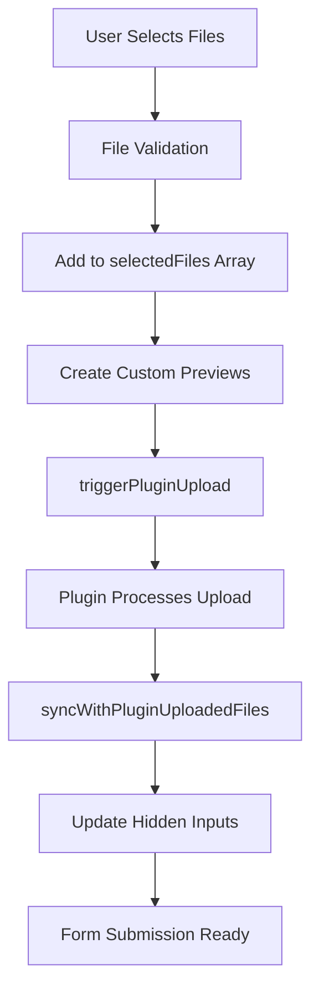

# File Upload Integration Documentation

## Problem Statement

We are migrating from native Contact Form 7 (WPCF7) file upload functionality to the "Drag and Drop Multiple File Upload for Contact Form 7" plugin while maintaining our custom Czech interface design and all existing functionality.

### Key Issues Identified

1. **File Attachment Problem**: While our custom interface shows correct file counts and previews, the actual files are not being attached to emails sent through Contact Form 7.

2. **Plugin Integration Challenge**: The plugin uses its own upload mechanism and hidden input system that differs from native WPCF7, requiring careful synchronization between our UI and the plugin's backend processing.

3. **UI Replacement Complexity**: Need to hide the plugin's default interface while maintaining its upload functionality and ensuring proper form submission.

## Current Architecture

### FileUpload Class Structure
- **Location**: `src/js/modules/file-upload.js`
- **Pattern**: Singleton class managing the entire file upload experience
- **Integration**: Detects plugin presence and creates custom Czech interface overlay

### Key Components

#### Plugin Detection
```javascript
// Multiple selector fallbacks for robust plugin detection
this.fileInput = document.querySelector('#realizace-upload') ||
                 document.querySelector('input[data-name="mfile-747"]') ||
                 document.querySelector('.wpcf7-drag-n-drop-file');
```

#### Interface Management
- **Plugin Elements Hidden**: `.codedropz-upload-handler`, `.dnd-upload-status`
- **Custom Interface**: Czech language drag-and-drop zone with animations
- **Preview System**: Custom file previews with click-to-remove functionality

#### File Processing Flow
1. **File Selection**: Via drag-drop or click interface
2. **Validation**: File type, size, and duplicate checking
3. **Plugin Upload**: Trigger plugin's upload mechanism
4. **Synchronization**: Sync with plugin's uploaded file references
5. **Form Submission**: Use real uploaded file paths in hidden inputs

## Current Implementation Status

### ✅ Working Features
- Custom Czech interface ("Přetáhněte fotky sem nebo klikněte pro nahrání")
- Drag and drop functionality
- File validation (type, size, duplicates)
- Visual animations using View Transitions API with CSS fallbacks
- File preview with thumbnail generation
- Click-to-remove functionality for entire preview area
- Plugin integration and detection

### 🔄 Recent Fixes (Latest Implementation)
- **triggerPluginUpload()**: Properly triggers plugin upload process
- **syncWithPluginUploadedFiles()**: Syncs with real uploaded file references
- **Enhanced createPluginHiddenInputs()**: Uses real uploaded values when available

### ❌ Known Issues
- Files show correct count in email notifications but are not actually attached
- Need to verify plugin upload process is working correctly
- May need additional integration with plugin's file handling system

## Technical Architecture

### Upload Process Flow


### File Data Structure
```javascript
{
  file: File,                    // Original File object
  id: number,                   // Unique identifier
  name: string,                 // File name
  size: number,                 // File size in bytes
  status: string,               // "selected", "uploaded", etc.
  uploadedValue?: string        // Real plugin upload reference
}
```

### Key Methods

#### setFilesToInput(files)
- Sets files to plugin input using DataTransfer API
- Calls `triggerPluginUpload()` for plugin integration

#### triggerPluginUpload(files)
- Clears existing plugin files
- Triggers plugin's change/input events
- Waits for plugin processing, then syncs

#### syncWithPluginUploadedFiles()
- Looks for plugin-generated hidden inputs
- Updates selectedFiles with real upload references
- Falls back to custom implementation if needed

#### createPluginHiddenInputs()
- Creates hidden inputs for form submission
- Uses real uploaded values when available
- Fallback to custom format: `custom_${fileId}_${fileName}`

## Styling Implementation

### SCSS Architecture
- **Location**: `src/scss/components/_file-upload.scss`
- **Approach**: Hide plugin elements, overlay custom interface
- **Animations**: Sophisticated CSS keyframes with View Transitions API support

### Key Animations
- `slideInFile`: File preview entrance animation
- `slideOutFileImproved`: Enhanced removal animation with 3D transforms
- `fadeInUp`: Staggered element appearance
- `pulse`: Interactive feedback on hover

### Mobile Responsiveness
- Responsive breakpoints for mobile devices
- Touch-friendly interaction areas
- Optimized animations for performance

## Configuration

### File Validation Settings
```javascript
config: {
  maxFileSize: 5 * 1024 * 1024,  // 5MB
  allowedTypes: ["image/jpeg", "image/jpg", "image/png"],
  allowedExtensions: [".jpg", ".jpeg", ".png"]
}
```

### Plugin Integration Settings
- **Field Name**: `mfile-747[]`
- **Plugin Wrapper**: `.codedropz-upload-wrapper`
- **Hidden Input Format**: Plugin-specific or custom fallback

## Testing Requirements

### Critical Test Cases
1. **File Upload and Email Attachment**: Verify files are actually attached to emails
2. **Plugin Synchronization**: Ensure custom UI syncs with plugin uploads
3. **File Removal**: Test file removal updates form state correctly
4. **Multiple File Handling**: Test with various file counts and types
5. **Error Handling**: Test with oversized files, invalid types, duplicates

### Browser Compatibility
- Modern browsers with DataTransfer API support
- Fallback messaging for older browsers
- View Transitions API with CSS animation fallbacks

## Next Steps

### Immediate Priority
1. **Verify Plugin Upload Process**: Test that plugin actually uploads files to server
2. **Debug Email Attachment**: Investigate why files aren't attaching to emails
3. **Plugin Communication**: Ensure proper event handling with plugin

### Future Enhancements
1. **Progress Indicators**: Show upload progress for large files
2. **File Type Preview**: Enhanced preview for different file types
3. **Bulk Operations**: Select all/remove all functionality
4. **Advanced Validation**: Custom validation rules per form

## Development Notes

### Plugin Dependencies
- **Required Plugin**: "Drag and Drop Multiple File Upload for Contact Form 7"
- **WordPress**: Contact Form 7 base plugin
- **Theme Integration**: Impreza child theme structure

### Build Process
- **CSS**: SCSS compilation with source maps for development
- **JavaScript**: ES6 modules with WordPress Scripts build system
- **Commands**: `npm run watch` for development, `npm run build` for production

### Debugging
- Comprehensive console logging with `[FileUpload]` prefix
- File state tracking throughout upload process
- Plugin interaction logging for troubleshooting

---

**Last Updated**: December 2024  
**Status**: Active development - file attachment issue resolution in progress  
**Priority**: High - critical for form functionality